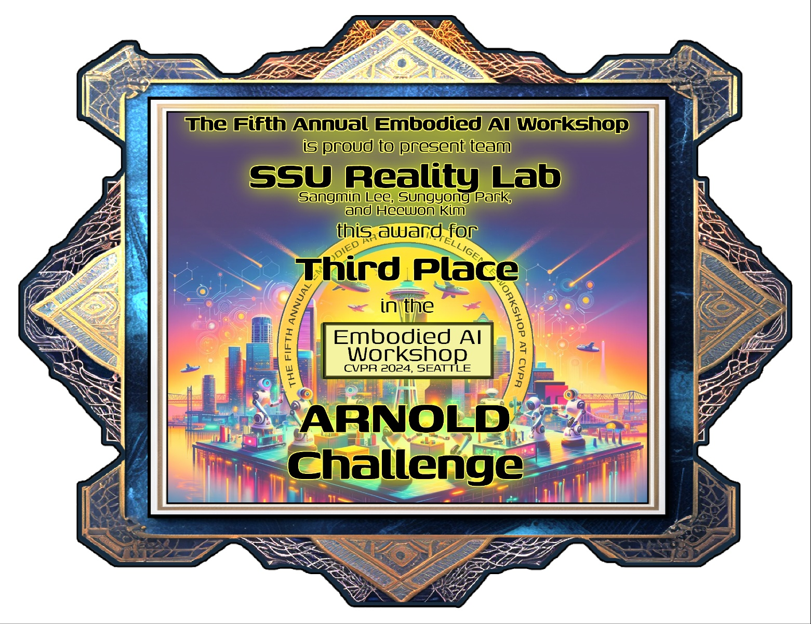
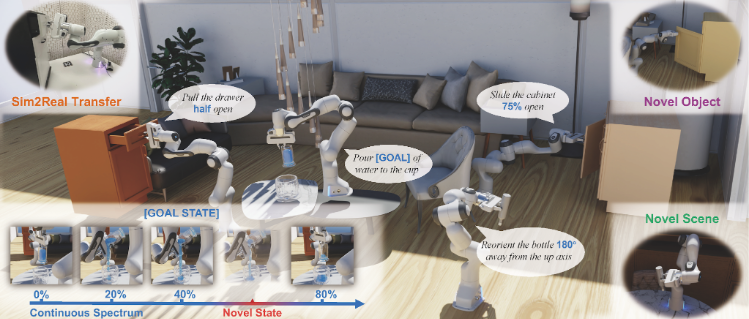
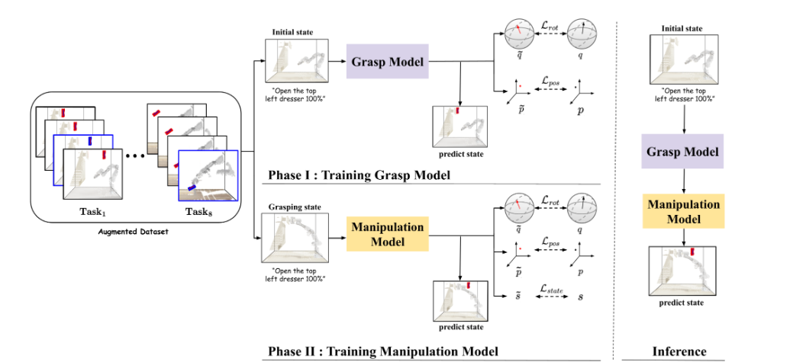
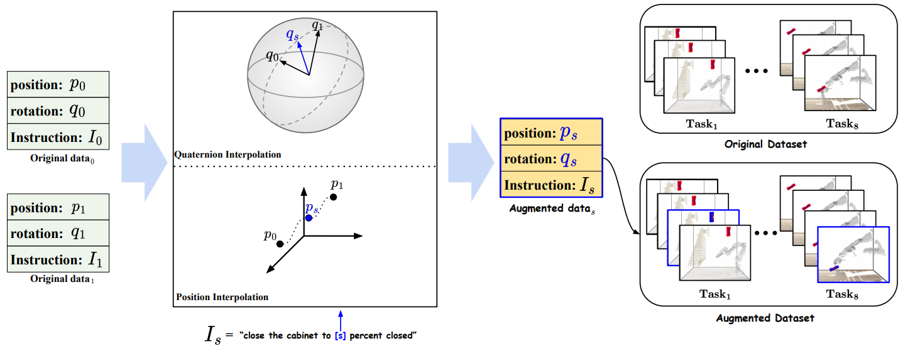

# ARNOLD Challenge: Continual Learning for Grasping and Manipulation

    
    

We participated in the ARNOLD Challenge and won 3rd place. 

Our model incorporates two key innovative ideas: Phase Specific Agents and State Interpolation for data augmentation, which significantly improved our performance metrics.

## Pipeline Overview
Our model pipeline involves two major components: Phase Specific Agents and State Interpolation for Data Augmentation

## Phase Specific Agents

We introduced Phase Specific Agents to our model, which resulted in a significant performance increase on the validation set from 32% to 45%. This approach involves creating specialized agents for different phases of the task, allowing for more precise and efficient learning.

### Grasp Model
Train model using PERACT

<strong>Grasp Model Training Progress</strong>

This section shows the progress of the grasp model at different training batches. The left image is at batch 0, and the right image is at batch 140,000.   <strong>GT: Brown head, Predict: Red head</strong>

For more images and details, visit the <a href="https://github.com/CaoCao-99/Arnold_combine/tree/main/Grasp_model/images">Grasp Model Image Directory</a>.

<table>
  <tr>
    <td> 
Batch 0
</td>
    <td> 
Batch 140,000
</td>
  </tr>
</table>

### Manipulate Model

<strong>Manipulate Model Training Progress</strong>

This section displays the progress of the manipulation model at different training batches. The left image is at batch 0, and the right image is at batch 180,000.   <strong>GT: Brown head, Predict: Red head</strong>

For more images and details, visit the <a href="https://github.com/CaoCao-99/Arnold_combine/tree/main/Manipulate_model/images">Manipulate Model Image Directory</a>.

<table>
  <tr>
    <td> 
Batch 0
</td>
    <td> 
Batch 180,000
</td>
  </tr>
</table>

## State Interpolation for Data Augmentation

Our second innovation was the application of State Interpolation for data augmentation. This technique enhanced our model's ability to generalize, improving the test set performance from 22% to 31%. State Interpolation involves generating intermediate states between actual data points, effectively increasing the training data diversity.

## Key Results
By incorporating these two innovations, our model achieved the following improvements:

- **Validation Set Performance:** Increased from 32% to 45%.
- **Test Set Performance:** Increased from 22% to 31%.

## Future Work
While our current model has shown significant improvements, there are several areas for future work:

1. **Exploring Additional Data Augmentation Techniques:** Investigating other data augmentation methods to further improve model generalization.
2. **Fine-Tuning Phase Specific Agents:** Refining the specialization of phase-specific agents to handle more complex tasks.

## Conclusion
The ARNOLD Challenge provided an excellent platform to test and validate innovative approaches to continual learning in grasping and manipulation tasks. Our model's performance highlights the potential of Phase Specific Agents and State Interpolation for Data Augmentation in enhancing robotic manipulation capabilities.

